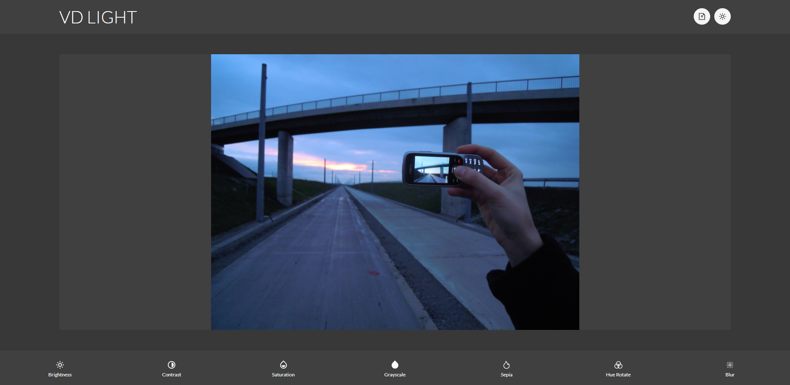
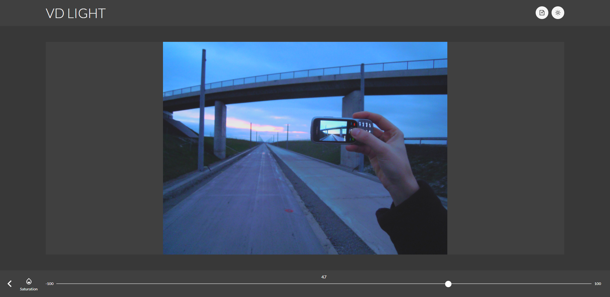

# Photo-Editor

## Check out website!

https://vd-photo-editor.netlify.app/

## Screen shots

### Desktop view

### Mobile view

## Installation and Setup Instructions

Clone down this repository. You will need `node` and `npm` installed globally on your machine.

Installation:

`npm install`

To Start Server:

`npm start`

To Visit App:

`localhost:3000`

## About

- The main idea of this project was to build a editing web site with modern UI.
- This project includes many parts of a modern website needs like responsivness, modern UI, pleasurable UX, light/dark theme, file uploading
- At the end of the day, the technologies implemented in this project are React, React-Router-Dom, Sass, JSX. App was created with `create-react-app`
